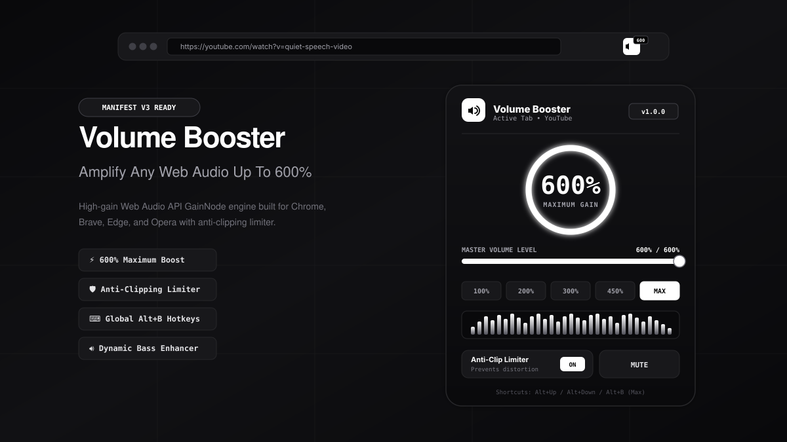

# Volume Booster — Up to 600% Audio Gain

<p align="center">
  
</p>

<p align="center">
  <a href="#-quick-download--installation"></a>
  <a href="#-features"></a>
  <a href="#-web-audio-pipeline"></a>
  <a href="LICENSE"></a>
</p>

---

## ⚡ Overview

**Volume Booster** is a high-performance, Manifest V3 Chrome Extension and Web Audio platform designed to amplify quiet videos, movies, podcasts, music, and streams up to **600% (6.0x unity gain)**. 

Equipped with an **Anti-Distortion Soft Limiter** and a **Low-End Bass Enhancer**, Volume Booster ensures audio sounds punchy, clear, and loud without the harsh digital clipping or crackle typical of naive gain tools.

---

## 📦 Downloadable Extension Pack

You can install Volume Booster immediately using either of these ready-to-load options:

1. **Pre-Built ZIP Archive**: [Download `volume-booster-extension.zip`](volume-booster-extension.zip)
2. **Direct Folder (Unpacked)**: The repository includes the complete ready-to-load extension in the [`/extension`](./extension) directory. No compilation or dependencies required!

---

## 🚀 Quick Installation Guide

Install in **Google Chrome**, **Brave**, **Microsoft Edge**, or **Opera** in less than 60 seconds:

### Step 1: Get the Extension Files
* **Option A**: Clone this repository:
  ```bash
  git clone https://github.com/your-username/volume-booster.git
  ```
* **Option B**: Download [`volume-booster-extension.zip`](volume-booster-extension.zip) and extract it to a folder on your computer.

### Step 2: Open Extensions Page
Open your browser and navigate to the extensions manager:
* **Google Chrome**: `chrome://extensions`
* **Brave Browser**: `brave://extensions`
* **Microsoft Edge**: `edge://extensions`
* **Opera**: `opera://extensions`

### Step 3: Enable Developer Mode
Turn on the **"Developer mode"** toggle in the top-right corner of the Extensions page.

### Step 4: Load the Extension
1. Click the **"Load unpacked"** button in the top-left corner.
2. Select the [`extension/`](./extension) directory (or your unzipped folder containing `manifest.json`).
3. Click the extension puzzle piece icon in your browser toolbar and pin **Volume Booster**.

---

## ✨ Features

- 🔊 **600% Maximum Volume Gain**: Multiply volume up to 6.0x for quiet YouTube videos, Netflix movies, Twitch streams, podcasts, and meeting recordings.
- 🛡️ **Anti-Distortion Soft Limiter**: Integrated studio-grade `DynamicsCompressorNode` with fast attack (3ms) and -3.0dB threshold to prevent speaker distortion, blown drivers, and crackle.
- ⚡ **Bass Enhancer**: Built-in 120Hz low-shelf biquad filter (+0dB to +15dB) restores warm low-end presence on thin laptop speakers or monitor outputs.
- 🎯 **Per-Tab Isolation**: Adjust volume independently for each browser tab. Boosting a quiet YouTube tab won't blast your Spotify music playing in another tab.
- ⌨️ **Global Keyboard Shortcuts**: Control volume instantly from anywhere without opening the popup.
- 📑 **Instant Bookmarklet**: Single-click script for quick boosting on computers where browser extension installation is restricted.
- 🎛️ **Live Web Tester**: Built-in spectrum analyzer and tone generator to calibrate and test volume levels with audio or custom MP3 uploads.

---

## ⌨️ Global Keyboard Shortcuts

| Shortcut | Action | Description |
| :--- | :--- | :--- |
| `Alt + Up` | **Volume Up** | Increases volume by +10% |
| `Alt + Down` | **Volume Down** | Decreases volume by -10% |
| `Alt + M` | **Mute / Unmute** | Silences or restores current tab audio |
| `Alt + B` | **MAX Boost** | Instantly jumps to 600% amplification |

*(Shortcuts can be customized anytime in `chrome://extensions/shortcuts`)*

---

## 🔬 Audio Processing Pipeline

Volume Booster routes any HTML5 `<audio>` or `<video>` stream through a real-time Web Audio API signal graph:

```
┌────────────────────────┐
│   HTMLMediaElement     │  (YouTube, Netflix, Spotify, HTML5 video/audio)
└───────────┬────────────┘
            │ createMediaElementSource()
            ▼
┌────────────────────────┐
│  BiquadFilterNode      │  (120Hz Low-Shelf Bass Enhancer: 0dB to +15dB)
└───────────┬────────────┘
            │
            ▼
┌────────────────────────┐
│      GainNode          │  (Linear Gain: 0.0x up to 6.0x / 600%)
└───────────┬────────────┘
            │
            ▼
┌────────────────────────┐
│ DynamicsCompressorNode │  (Soft Limiter: -3dB Threshold, 16:1 Ratio, 3ms Attack)
└───────────┬────────────┘
            │
            ▼
┌────────────────────────┐
│ AudioContext Destination│ (Laptop speakers, headphones, or external monitor)
└────────────────────────┘
```

---

## 📑 1-Click Bookmarklet (No Install Required)

If you are on a restricted work or school machine where installing extensions is disabled, drag or save this bookmarklet to your bookmarks bar:

```javascript
javascript:(function(){if(window.__volBoosterLoaded){var v=prompt("Volume Booster (0 - 600%):","300");if(v!==null)window.__setVolBoost(parseInt(v,10));return;}window.__volBoosterLoaded=true;var ctx=new(window.AudioContext||window.webkitAudioContext)();var media=Array.from(document.querySelectorAll('audio,video'));if(!media.length){alert("Volume Booster: No audio or video found on this page.");return;}var gainNodes=[];media.forEach(function(m){try{var src=ctx.createMediaElementSource(m);var gain=ctx.createGain();gain.gain.value=3.0;var comp=ctx.createDynamicsCompressor();src.connect(gain);gain.connect(comp);comp.connect(ctx.destination);gainNodes.push(gain);}catch(e){}});window.__setVolBoost=function(pct){var factor=Math.max(0,Math.min(600,pct))/100;gainNodes.forEach(function(g){g.gain.value=factor;});};alert("Volume Booster active! Boosted to 300%. Click bookmarklet again to adjust.");})();
```

---

## 📂 Project Structure

```
├── extension/                       # Ready-to-load Chrome Extension (Manifest V3)
│   ├── manifest.json                # Extension manifest configuration & permissions
│   ├── background.js                # Service worker managing tabs, shortcuts, badge
│   ├── content.js                   # Injected audio graph interceptor script
│   ├── popup.html                   # Extension popup interface
│   ├── popup.css                    # Popup dark monochrome styling
│   ├── popup.js                     # Popup state manager & real-time controls
│   └── icons/                       # High-res extension icons (16px, 48px, 128px)
│
├── src/                             # Live Web Application Companion
│   ├── audio/                       # Web Audio engine, oscillator synth & spectrum
│   ├── components/                  # UI deck, visualizer, volume controls, header
│   ├── utils/                       # ZIP packager & bookmarklet generator
│   └── App.tsx                      # Single-view master booster application
│
├── preview.svg                      # High-resolution vector preview banner for GitHub
├── volume-booster-extension.zip    # Pre-packaged, downloadable ZIP archive
└── package.json                     # Vite & build configuration
```

---

## 🛠️ Local Development & Web Companion

To run the interactive web companion locally:

```bash
# 1. Install dependencies
npm install

# 2. Start the development server
npm run dev
```

Visit `http://localhost:3000` to test volume amplification in real time with the built-in audio synth or your own uploaded audio files.

To build the static distribution:
```bash
npm run build
```

---

## 📄 License

This project is licensed under the [MIT License](LICENSE). Free to use, modify, and distribute for personal and commercial applications.
